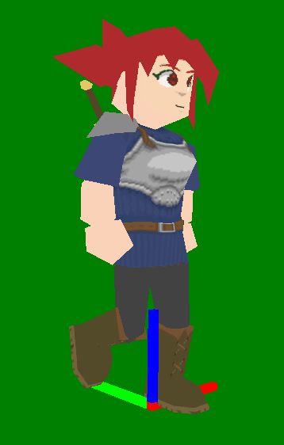

# Sausage64

Sausage64 is a plugin for Blender 2.7 onwards, which allows you to export "sausage link" style character models with animations.

The plugin exports the data as an easily parsable text file. This file should be simple to convert to other formats, more suitable for your target platform. 

The plugin's code is documented, and contains a ton of helper classes that store the information before exporting. This should allow you to modify the script to instead output the data in a format you want, as opposed to an intermediary format like s64.

This repository contains five folders:
* `Plugin` - The Blender plugin itself. Installation instructions provided in a further section of this README. 
* `Sample Model` - An example character model with animations, with the source files available alongside the .s64 file exported by the plugin. `Catherine.blend` is for 2.7, with `Catherine 2.8.blend` for Blender versions 2.8 onwards. 
* `Sample Parser` - An example Sausage64 to N64 display list converter, written in C. More info about the program in the folder's README. 
* `Sample Previewer` - An example Sausage64 model previewer, written in C++ and OpenGL. More info about the program in the folder's README. 
* `Sample Library` - An example library for the N64, designed for the output from `Sample Parser`. More info about the library in the folder's README. 
* `Sample ROM` - An example N64 ROM (written in Libultra and Libdragon) displaying the character and the animations in action, with the help of the `Sample Library`. The .s64 file and the textures were converted to display lists and other parsable data with the `Sample Parser` program. More information available in the folder's README. 

### What do you mean by Sausage Links?
Sausage link characters are made out of different unconnected segments. This is also known as "hierarchical modeling".

Photo taken from: https://bradh2002.wordpress.com/a2-task-3-video-game-history/
  

This method of character design was highly popular in the N64 and PS1 era, where animating vertex skinned characters was considered a very heavy operation. Instead, these models leverage the fact that each segment can easily be transformed via a matrix.

### Installation 
1. Grab the python file that is inside the `Plugin` folder.
2. Open Blender, and go to your user preferences.
3. Go to the addons tab, and select `Install...` or `Install from File` button (the name depends on your version of Blender).
4. Find the python script in the file browser and open it. 
5. The script `Sausage64 Character Export` should appear. Tick the checkbox to enable it. 
6. If you are on Blender 2.8 onwards, you're all set! If you are on an earlier version of Blender, you will get a warning that the script is for a newer version of Blender. You can safely ignore this warning. Don't forget to press the `Save User Preferences` button. 

### S64 file format, Usage Instructions, FAQ, and More
For more information, please check the [wiki](../../wiki). Please note that the Wiki is only updated every release, therefore the information might not match what is in the current repository.

### Suggestions and bugs
Please submit suggestions or bugs to the [issues](issues) page.