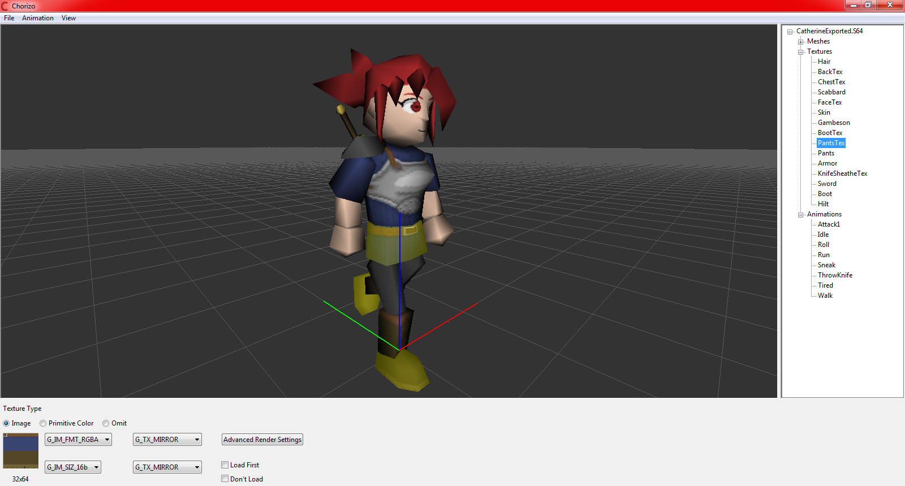

# Chorizo - A Sample Sausage64 Model Viewer

This folder contains a cross platform sample program that lets you view Sausage64 models, and to create material definitions for Arabiki in a visual manner.

### System Requirements

Windows

    
* Windows XP or higher.
* An OpenGL capable device.

Linux

    
* Ubuntu (Haven't tested with others)
* An OpenGL capable device.

### Compiling

This program uses [wxWidgets](https://www.wxwidgets.org/) to allow for a cross platform GUI. 

Windows

**If you cloned this repo, make sure that the GLM submodule was properly downloaded. Check the `Include` folder. If it does not have GLM inside, you must run `git submodule update --init --recursive`, or download GLM from [here](https://github.com/g-truc/glm) and place it there manually.**
    
Start by installing or building wxWidgets using this [guide](https://docs.wxwidgets.org/trunk/plat_msw_install.html). **Make sure you compile with OpenGL enabled.** If you are able to compile the OpenGL samples (located in wxWidgets/samples/opengl), then you have succeeded.

If you have successfully installed wxWidgets, then simply open `Chorizo.vcxproj` with Visual Studio 2019 or higher, and compile.

Linux

**If you cloned this repo, make sure that the GLM submodule was properly downloaded. Check the `Include` folder. If it does not have GLM inside, you must run `git submodule update --init --recursive`, or download GLM from [here](https://github.com/g-truc/glm) and place it there manually.**

Start by installing or building wxWidgets using this [guide](https://docs.wxwidgets.org/trunk/plat_gtk_install.html). **Make sure you compile with OpenGL enabled.** If you are able to compile the OpenGL samples (located in wxWidgets/samples/opengl), then you have succeeded.

If you have successfully installed wxWidgets, then simply run `make` to compile.

